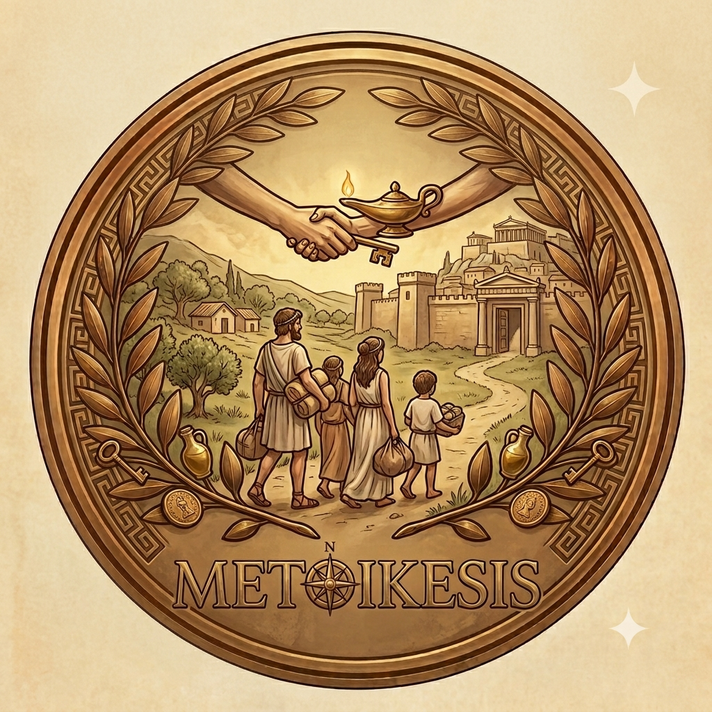

<div align="left">
  
 
</div>

# Metoikesis


**Metoikesis** (μετοίκησις) - from the ancient Greek word meaning "permanent change of residence" - is a spatial migration model for human geographers. It simulates the movement and settlement patterns of populations based on socioeconomic attributes, allowing researchers to explore how individual decisions aggregate into spatial patterns.


## Overview

Metoikesis moves beyond traditional Schelling segregation models by incorporating detailed agent attributes (age, income, education, employment, etc.) and multi-area dynamics. Agents make migration decisions based on their personal characteristics and the characteristics of their neighbors, creating emergent spatial patterns that can be studied and analyzed.

### Key Features

- **Agent-Based Modeling** – Each agent has unique attributes including age, gender, income, education, employment status, home ownership, and length of residence
- **Two-Area Dynamics** – Agents can move within their area OR migrate between two distinct regions
- **Income-Based Segregation** – Agents prefer neighbors with similar income levels (configurable threshold)
- **Origin Tracking** – Visual indicators show whether agents are in their original area or have migrated (white circle = Area 0, black circle = Area 1)
- **Multiple Display Modes** – Toggle between showing agent type (gender) or income distribution
- **Real-Time Visualization** – Watch segregation and migration patterns emerge in real-time
- **Full Control** – Start, stop, and reset the simulation at any time

## Getting Started

### Prerequisites

- Go 1.21 or later
- Fyne v2.8.0

### Installation

```bash
# Clone the repository
git clone https://github.com/yourusername/Metoikesis.git
cd Metoikesis/src

# Download dependencies
go mod download

# Run the simulation
go run ./cmd/metoikesis
```

### Building

```bash
# From the src directory
go build -o metoikesis ./cmd/metoikesis

# Or use fyne to build with embedded configuration
fyne build
```

## How It Works

### Agent Attributes

Each agent in Metoikesis has a set of attributes that influence their behavior:

| Attribute | Description | Range/Options |
|-----------|-------------|---------------|
| **Age** | Years (20-80) | Influences mobility |
| **Gender** | Male, Female, Other | Display color |
| **Income** | Annual income | Drives segregation |
| **Education** | No Formal to Doctorate | Affects mobility |
| **Employment** | Employed, Unemployed, Retired, Student | Affects mobility |
| **Home Owner** | Yes/No | Homeowners are less mobile |
| **Years at Residence** | 0-30 | Long-term residents are less mobile |

### Movement Decisions

Agents decide to move based on two factors:

1. **Happiness** – An agent is unhappy if fewer than the threshold percentage of their neighbors have similar incomes. Unhappy agents look to move.

2. **Inter-Area Migration** – Agents have a probability of migrating to the other area based on their attributes (younger, higher income, renters, and unemployed agents are more likely to move between areas).

### Visual Guide

The main display shows two areas side by side:

| Element | Meaning |
|---------|---------|
| **Base Color** | Shows either agent type (gender) or income level |
| **White Circle ●** | Agent originated in Area 0 |
| **Black Circle ●** | Agent originated in Area 1 |

When an agent moves between areas, the circle moves with them, showing where they came from.

## Menu Options

| Menu | Item | Action |
|------|------|--------|
| **View** | Type | Show agents by gender |
| **View** | Income | Show agents by income (red = low, green = high) |
| **Run** | Start | Start or resume simulation |
| **Run** | Stop | Pause the simulation |
| **Run** | Reset | Reset the world to a random state |

## Future Development

Metoikesis is designed to be extended. Planned features include:

- [ ] More than two areas
- [ ] Additional agent attributes (ethnicity, occupation, etc.)
- [ ] Export simulation data
- [ ] Import real geographic data
- [ ] Statistical analysis tools
- [ ] Network visualization of migration flows

## Project Structure

```
Metoikesis/
├── src/
│   ├── cmd/
│   │   └── metoikesis/
│   │       └── main.go          # GUI application
│   ├── pkg/
│   │   └── model/
│   │       ├── types.go         # Data structures
│   │       └── model.go         # Core simulation logic
│   ├── FyneApp.toml             # Build configuration
│   └── go.mod                   # Go module definition
├── img/
│   └── Metoikesis.png           # Screenshot
├── LICENSE
└── README.md
```

## License

This project is licensed under the MIT License - see the [LICENSE](LICENSE) file for details.

## Acknowledgments

- Inspired by Thomas Schelling's work on segregation models (1971)
- Named by the project team after the ancient Greek concept of permanent migration
- Built with [Fyne](https://fyne.io/) - a cross-platform GUI toolkit for Go

## Contributing

Contributions are welcome! Please feel free to submit a Pull Request.

1. Fork the repository
2. Create your feature branch (`git checkout -b feature/AmazingFeature`)
3. Commit your changes (`git commit -m 'Add some AmazingFeature'`)
4. Push to the branch (`git push origin feature/AmazingFeature`)
5. Open a Pull Request

