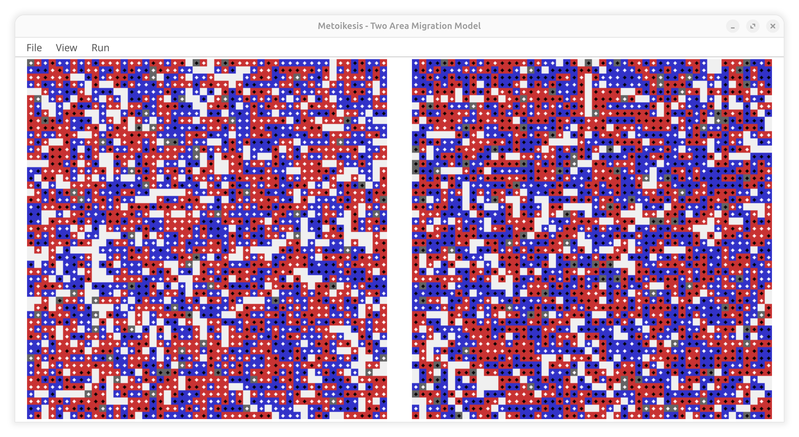

<div align="center">
  
  <h1>Metoikesis</h1>
  <p><em>μετοίκησις — permanent change of residence</em></p>
</div>

---

**Metoikesis** is a spatial migration model for human geographers. It simulates the movement and settlement patterns of populations based on socioeconomic attributes, allowing researchers to explore how individual decisions aggregate into spatial patterns across multiple regions.



## Overview

Metoikesis moves beyond traditional Schelling segregation models by incorporating:

- **Detailed agent attributes** (age, income, education, employment, etc.)
- **Multi-area dynamics** – agents can move within their area OR migrate between two distinct regions
- **Income-based similarity** – agents prefer neighbors with similar income levels
- **Origin tracking** – visual indicators show migration history

## Key Features

- **Agent-Based Modeling** – Each agent has unique attributes including age, gender, income, education, employment status, home ownership, and length of residence
- **Two-Area Dynamics** – Agents can move within their area OR migrate between two distinct regions with configurable probabilities
- **Income-Based Segregation** – Agents prefer neighbors with similar income levels (configurable threshold, default 20% similarity)
- **Origin Tracking** – Visual indicators show whether agents are in their original area or have migrated:
  - **White circle ●** = originated in Area 0
  - **Black circle ●** = originated in Area 1
  - Circles follow the agent even when they move between areas
- **Multiple Display Modes** – Toggle between showing agent type (gender) or income distribution
- **Real-Time Visualization** – Watch segregation and migration patterns emerge in real-time
- **Full Control** – Start, stop, and reset the simulation at any time

## How It Works

### Agent Attributes

Each agent in Metoikesis has a set of attributes that influence their behavior:

| Attribute | Description | Range/Options | Effect on Mobility |
|-----------|-------------|---------------|-------------------|
| **Age** | Years | 20-80 | Younger = more mobile |
| **Gender** | Male, Female, Other | Categorical | Display color only |
| **Income** | Annual income | $20,000-$100,000+ | Drives segregation + mobility |
| **Education** | No Formal to Doctorate | 7 levels | Higher education = more mobile |
| **Employment** | Employed, Unemployed, Retired, Student | Categorical | Unemployed = more mobile |
| **Home Owner** | Yes/No | Boolean | Renters = more mobile |
| **Years at Residence** | Years at current location | 0-30 | Longer = less mobile |

### Movement Decisions

Agents decide to move based on two factors:

1. **Intra-Area Movement (Happiness)** – An agent is unhappy if fewer than the threshold percentage (default 30%) of their neighbors have similar incomes. Unhappy agents look for the nearest compatible empty spot with similar-income neighbors.

2. **Inter-Area Migration** – Each agent has a probability of migrating to the other area based on:
   - **Age** (younger = more likely)
   - **Income** (higher income = more likely)
   - **Education** (higher education = more likely)
   - **Home ownership** (renters = more likely)
   - **Employment** (unemployed = more likely)
   - **Years at residence** (shorter tenure = more likely)

The inter-area probability is multiplied by a configurable factor (default 0.5) to control overall migration rate.

### Visual Guide

The main display shows two areas side by side:

| Element | Meaning |
|---------|---------|
| **Base Color** | Shows either agent type (gender) or income level (red = low, green = high) |
| **White Circle ●** | Agent originated in Area 0 (stays with agent) |
| **Black Circle ●** | Agent originated in Area 1 (stays with agent) |

When an agent moves between areas, the circle moves with them, clearly showing migration patterns.

## Getting Started

### Prerequisites

- Go 1.21 or later
- Fyne v2.8.0 (automatically installed with `go mod download`)

### Installation

```bash
# Clone the repository
git clone https://github.com/yourusername/Metoikesis.git
cd Metoikesis/src

# Download dependencies
go mod download

# Run the simulation
go run ./cmd/metoikesis
```

### Building

```bash
# From the src directory
go build -o metoikesis ./cmd/metoikesis

# Or use fyne to build with embedded configuration
fyne build

# Run the built binary
./metoikesis
```

## Menu Options

| Menu | Item | Action |
|------|------|--------|
| **View** | Type | Show agents by gender (Blue = Male, Red = Female, Gray = Other) |
| **View** | Income | Show agents by income (Red = low income → Green = high income) |
| **Run** | Start | Start or resume the simulation |
| **Run** | Stop | Pause the simulation |
| **Run** | Reset | Reset the world to a random state and auto-start |

## Project Structure

```
Metoikesis/
├── src/
│   ├── cmd/
│   │   └── metoikesis/
│   │       └── main.go          # GUI application
│   ├── pkg/
│   │   └── model/
│   │       ├── types.go         # Agent and world data structures
│   │       └── model.go         # Core simulation logic
│   ├── FyneApp.toml             # Fyne build configuration
│   └── go.mod                   # Go module definition
├── img/
│   ├── Metoikesis.png           # Project logo
│   └── screen_1.png             # Screenshot of running simulation
├── LICENSE
└── README.md
```

## Future Development

Metoikesis is designed to be extended. Planned features include:

- [ ] More than two areas
- [ ] Additional agent attributes (ethnicity, occupation, etc.)
- [ ] Export simulation data to CSV/JSON
- [ ] Import real geographic data
- [ ] Statistical analysis tools (Gini coefficient, segregation indices)
- [ ] Network visualization of migration flows
- [ ] Configurable agent generation parameters

## License

This project is licensed under the MIT License - see the [LICENSE](LICENSE) file for details.

## Acknowledgments

- Inspired by Thomas Schelling's work on segregation models (1971)
- Named after the ancient Greek concept of permanent migration
- Built with [Fyne](https://fyne.io/) - a cross-platform GUI toolkit for Go

## Contributing

Contributions are welcome! Please feel free to submit a Pull Request.

1. Fork the repository
2. Create your feature branch (`git checkout -b feature/AmazingFeature`)
3. Commit your changes (`git commit -m 'Add some AmazingFeature'`)
4. Push to the branch (`git push origin feature/AmazingFeature`)
5. Open a Pull Request

---

<div align="center">
  <p><em>Metoikesis — Understanding migration, one agent at a time.</em></p>
</div>
